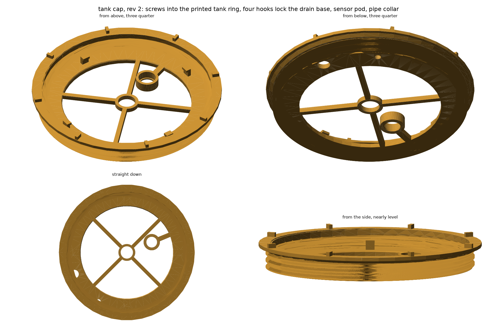
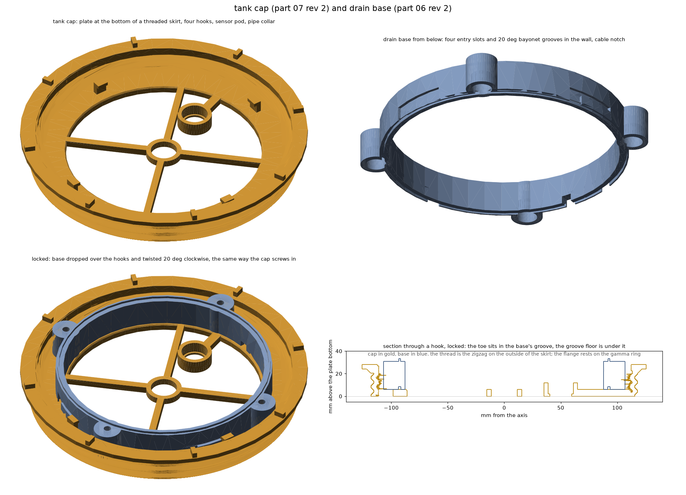

# cad

i modelled everything on onshape and have the .STEP export here

## parts

| # | name | status | file |
|---|---|---|---|
| 00 | 50.6 test socket | done | `50.6 Test Socket.step` |
| 01 | grow module | done | `Grow Module.step` |
| 02 | root grate | done | `Root Grate.step` |
| 03 | water spreader | done | `Water Spreader.step` |
| 04 | tower lid | done | `Tower Lid.step` |
| 05 | lid cap | done | `Lid Cap.step` |
| 06 | drain base | rev 2 | `Drain Base.step` |
| 07 | tank lid plate | rev 2 | `Tank Lid Plate.step` |
| 08 | tank ring | done | `Tank Ring.step` |

05 was going to be a jet splitter. the pump doesnt make a jet, so the lid does the
distributing and 05 is just a cap now.

there was going to be a level sensor riser. a post above the plate cannot see the
water, because the plate is the lid. the fix was the fill line: MAX_FILL_DEPTH is
now 165 so the flush sensor clears its 200mm blind zone, and the sensor sits in a
pod on the plate instead of on a riser.

## rev 2 of 06 and 07, and 08: the plate is the cap, the ring is ours, and it holds the tower

the plate screws into a printed ring, part 08, that snaps onto the bucket rim the
way a gamma seal ring does. so no gamma seal. the plate is a shallow cup: the plate
at the bottom, a 20 tall skirt rising from its rim with an external thread (236
major, 8 pitch, single start, 2.5 turns, 45 deg flanks), and a 252 flange at the
top that sits on the ring, with eight grip ribs on it. four hooks stand on the
plate between the rod bosses.

the ring is 311 across, one piece: a 4 thick plate standing 12 above the rim on a
support ring, the internal thread skirt hanging 9 into the bucket mouth, and twelve
snap fingers outside the rim, each 30 wide and 1.8 thick with a lip that hooks 2
under the rim's bead. bucket numbers are from a model of the home depot bucket
(thingiverse 3688345, `journal/cad-tools/bucket_slice.py` measures it): bead
D304.8 and 7.2 tall, wall D291.9 below it. measure the real bead; the ring has a
millimetre of margin each way. the thread pair was checked by ray casting the cap's
crests and flanks against the ring (0 of 1086 points inside when screwed home, 362
half a turn out), and the snap by casting the ring against the bucket model.
the drain base got four entry slots and 20 deg bayonet grooves cut into its outer
wall to match: drop it in, twist 20 deg clockwise, and it is locked. the twist is the
same direction as screwing the cap in. there is no spigot on the plate any more, the
hooks locate the base. the base also has a cable notch at 22.5 deg for the level
sensor lead, which leaves the pod inside the base.

all three were built in cadquery and exported to step, then imported into
onshape as part studios (the step is the source, the studios are not parametric).
the numbers are in `cap.py` and `ring.py`, the models in `cap_cq.py`, `base_cq.py`
and `ring_cq.py` (local, in journal/cad-tools). `tank-cap.png` is the
cap on its own, `tank-cap-and-base.png` the pair, `tank-ring.png` the ring and the
whole stack on the bucket.

printing: the cap goes plate down, everything on it points up, thread flanks and
the flange underside are 45 deg, no support. the base prints bottom down as before,
it only gained cuts. the ring goes plate down too, fingers and skirts up, no
support, but it is 311 across.

## sizes

| part | volume | mass at 15% infill |
|---|---|---|
| grow module | 656.61 cm3 | ~470 g |
| root grate | 50.51 cm3 | ~40 g |
| water spreader | 36.72 cm3 | ~30 g |
| tower lid | 247.22 cm3 | ~100 g |
| lid cap | 80.57 cm3 | ~79 g |
| drain base | 118.80 cm3 | ~90 g |
| tank lid plate | 242.81 cm3 | ~170 g |
| tank ring | 268.60 cm3 | ~188 g |

one tower is 4 modules, 4 grates, 4 spreaders, 1 lid, 1 cap, 1 drain base, 1 tank plate,
1 tank ring.

## assembly

`Tower Assembly` on onshape has all 16 parts placed. z = 0 is module 1's underside.

| part | count | z bottom .. z top |
|---|---|---|
| grow module | 4 | 0..202.2, then every 200 up to 600..802.2 |
| root grate | 4 | 30..34, then every 200 |
| water spreader | 4 | 44.8..190, then every 200 |
| tower lid | 1 | 800..819 |
| lid cap | 1 | 816..831 |
| drain base | 1 | -25..2.2 |
| tank lid plate | 1 | -31..-25, hooks to -14, skirt and flange up to -3, ribs to 2 |
| tank ring | 1 | plate -11..-7, thread skirt to -32, fingers to -34.2 |
| bucket rim | | -23. the bucket floor is at -391 |

the drain base sits inside the cap's skirt, and the cap's flange rests on the
ring's plate, which stands 12 above the bucket rim. 854 mm from the bucket rim to
the top of the cap, 311 across at the ring. the base is not spun (its rod holes
stay on 45 / 135 / 225 / 315), the cap is spun +20 so the base is in its locked
position, and the ring another +135 so the two threads are in phase.

 the grate is not on a ledge, it wedges on the module's funnel cone, which
hits r90 at z 32. rod holes are D6.5 at r99 on 45 / 135 / 225 / 315 and line up
through the module bosses, the lid, the cap and the base.
