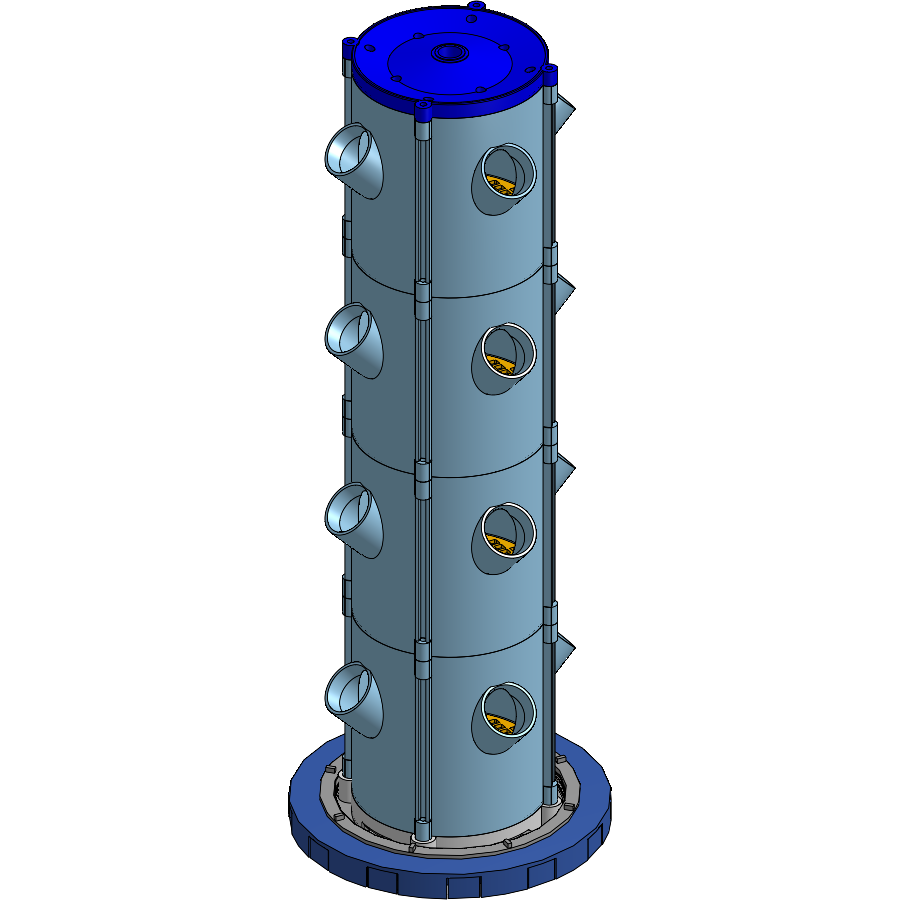
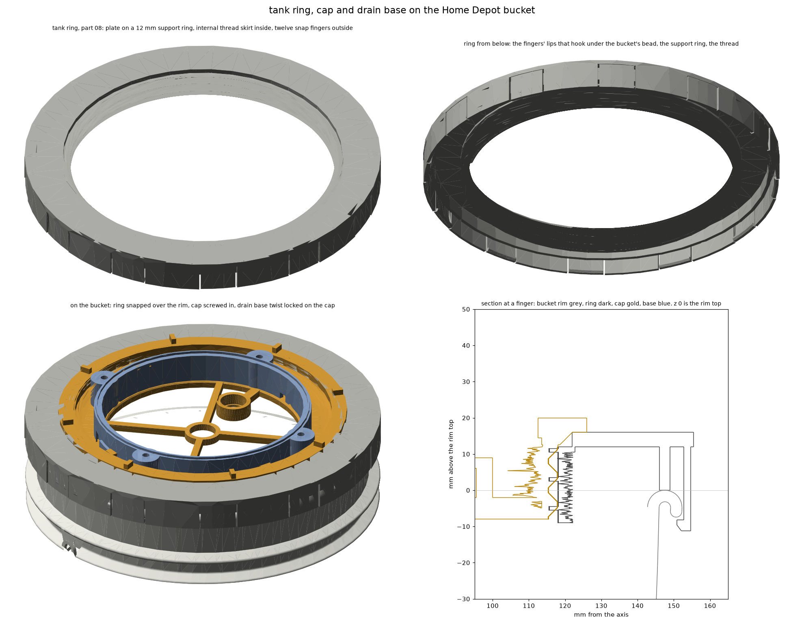

# cad

step exports of every printed part. 00 to 05 were modelled in onshape, 06 to 08
in cadquery and imported into onshape. `Tower Assembly` on onshape has all of them
placed. pictures are in `../images`.

## parts

| # | name | file | volume |
|---|---|---|---|
| 00 | 50.6 test socket | `50.6 Test Socket.step` | |
| 01 | grow module | `Grow Module.step` | 656.61 cm3 |
| 02 | root grate | `Root Grate.step` | 50.51 cm3 |
| 03 | water spreader | `Water Spreader.step` | 36.72 cm3 |
| 04 | tower lid | `Tower Lid.step` | 247.22 cm3 |
| 05 | lid cap | `Lid Cap.step` | 80.57 cm3 |
| 06 | drain base | `Drain Base.step` | 118.80 cm3 |
| 07 | tank lid plate | `Tank Lid Plate.step` | 242.81 cm3 |
| 08 | tank ring | `Tank Ring.step` | 268.60 cm3 |

one tower is 4 modules, 4 grates, 4 spreaders, and one of everything else.

## how the bottom goes together

* the tank ring snaps over the bucket rim on twelve fingers and carries an
  internal thread. it stands in for a gamma seal ring
* the tank lid plate is a cup that screws into the ring. 236 major, 8 pitch,
  2.5 turns, 45 deg flanks, a 252 flange with grip ribs. it carries the pipe
  collar, the level sensor pod and the probe cable holes
* the drain base drops onto four hooks on the plate and twists 20 deg clockwise
  to lock. the same direction as screwing the cap in
* bucket numbers came from a model of the home depot bucket: bead D304.8 and
  7.2 tall, wall D291.9 under it. measure the real rim before printing the ring
* all three print without support. the cap and ring plate down, the base bottom
  down. the ring is 311 across

## assembly

