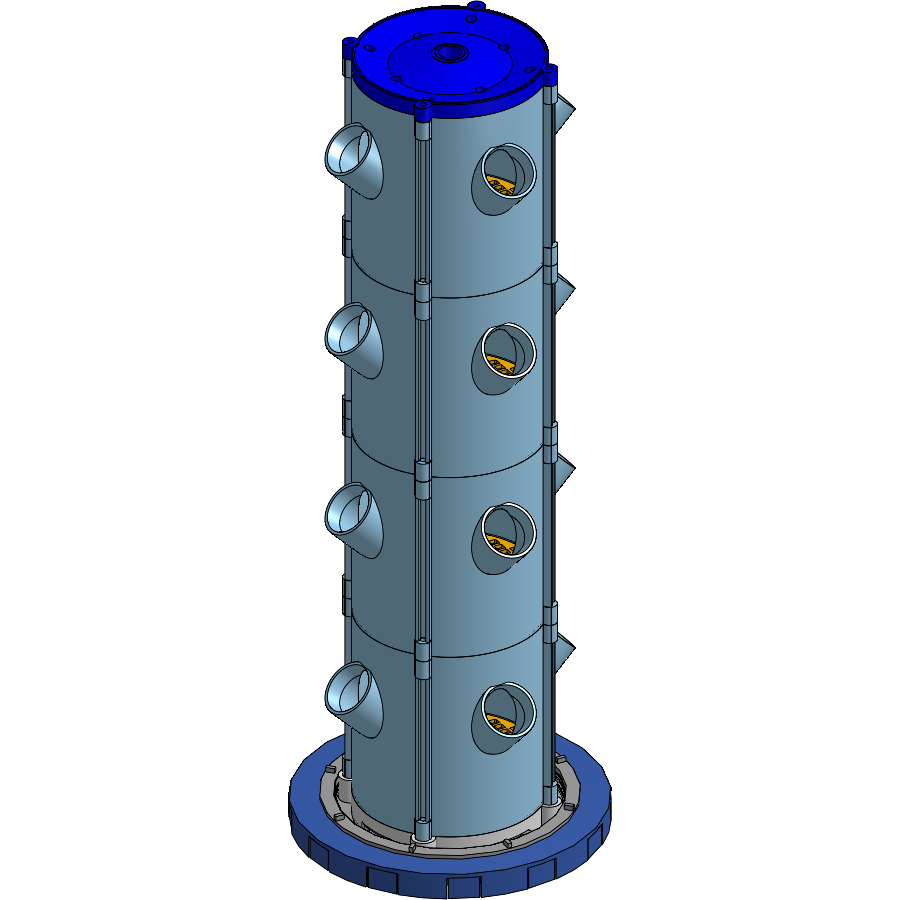
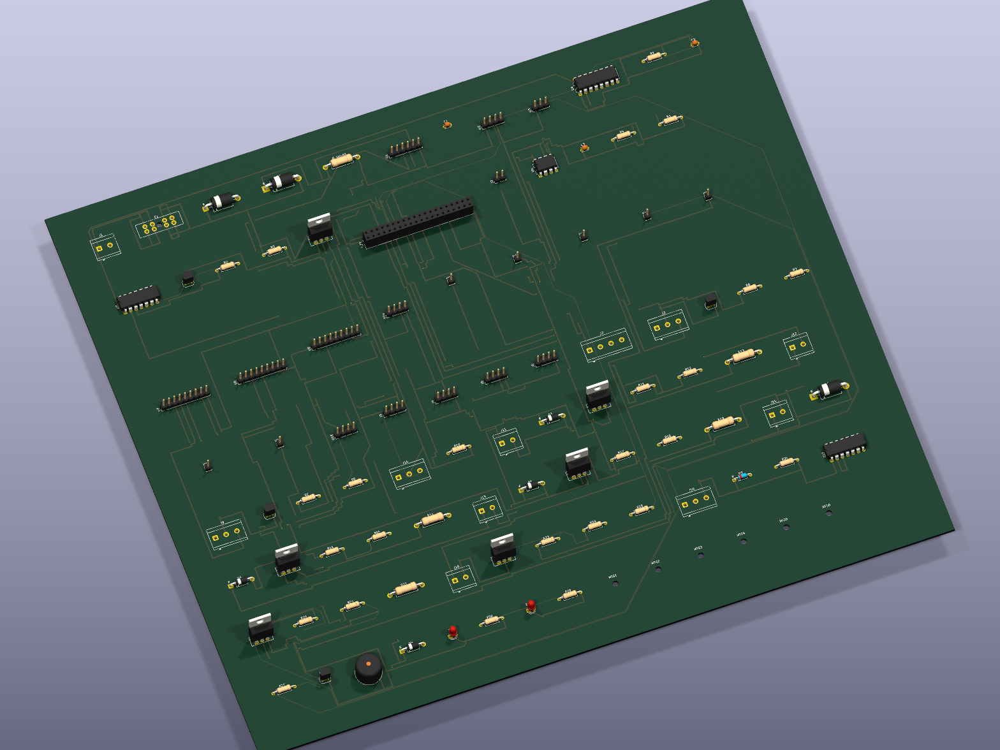

# vertical hydroponic garden

[](https://kicanvas.org/?repo=https://github.com/DagaVedant/Hydroponic-Garden/tree/main/PCB/kicad/hat)

a modular 3d printed hydroponic tower, with one pump, one pipe, and no pumps per level. the shape of the part is the entire system

**[onshape](https://cad.onshape.com/documents/e7b652182e17b56d968bf971/w/74d572342f8ebf967bd0880e/e/9edb8eefc30c47e9fd32fa36?renderMode=0&uiState=6aa58dd8d5139ca4163fd859)**

**[KiCanvas](https://kicanvas.org/?repo=https://github.com/DagaVedant/Hydroponic-Garden/tree/main/PCB/kicad/hat)**

## why

i wanted a hydroponic tower thats one efficent, two scalable, and doesnt need tons of tubes to water each layer. this one needs one pump, its modular, and each level gets the same amount of water as all the others

## photos





the hat is a single 4-layer board, 217 x 226mm (down from an original 330 x 283mm). you can check it out in the link here [how it's wired](#how-its-wired)

## non-pcb wiring

```
120 V AC wall
  └── GFCI outlet, manual reset
        ├── pump, 30 W ................. always on
        ├── 12 V 100 W PSU  ............ one rail for everything
        │     ├── LED strip, fan ....... switched via the hat's PCA9685 PWM driver
        │     └── 3 dosing pumps ....... 12 V, same PWM driver
        └── Pi 5, over its own USB-C ... powered separately
```

## repo

| | |
|---|---|
| [BOM.csv](BOM.csv) | just a Bill Of Materials [below](#bill-of-materials) |
| [CAD/](CAD/) | .STEP export + what each file is on the onshape |
| [PCB/](PCB/) | raspberry pi 5 hat (`.kicad_pro`/`.kicad_sch`/`.kicad_pcb`)|
| [pi/](pi/) | the pi firmware `control.py`, `store.py`, `web.py` |
| [twoboard_vertical_garden/](twoboard_vertical_garden/) | the old pi 4b + pico two-board design (kicad source, gerbers, pico firmware)...im not building that but i left it as reference(was able to cut the costs a lot by switching to a single board design|

## bill of materials

just copied from [BOM.csv](BOM.csv)

| Item | Description | Qty | Unit Price (USD) | Total (USD) | Supplier | Status |
|---|---|---|---|---|---|---|
| **ALREADY OWN** |  |  |  |  |  |  |
| 5 gal bucket | 302mm OD x 368mm tall, 18.9 L. the nutrient tank. no reservoir means no loop | 1 | 0.00 | 0.00 | N/A | OWNED |
| GROWNEER SML-630 submersible pump | 550 GPH, 2.2m lift, 30W, 120V AC. the only thing that moves water, everything after it is gravity | 1 | 0.00 | 0.00 | N/A | OWNED |
| 1/2in PVC Schedule 40 pipe 10ft | 21.34mm OD. carries water pump to top in one unbroken run | 1 | 0.00 | 0.00 | N/A | OWNED |
| Analog pH interface board | signal conditioning with bnc socket. nutrients only dissolve in a narrow ph band | 1 | 0.00 | 0.00 | Amazon | OWNED |
| | **SUBTOTAL** | | | **0.00** | | |
| **SELF FUNDED** |  |  |  |  |  |  |
| [PETG filament white 1kg](https://www.amazon.com/ELEGOO-Filament-Dimensional-Accuracy-Printers/dp/B0D41YYVJN) | elegoo, 1.75mm. for anything that lives in water -- tank ring, cap, drain base. 2 spools, ~2kg | 2 | 15.99 | 31.98 | Amazon | SELF-FUNDED |
| [PLA filament light blue 1kg](https://www.amazon.com/ELEGOO-Filament-Dimensional-Accuracy-Cardboard/dp/B0C6QD6456) | elegoo sky blue, 1.75mm. for prototypes and the consumable grates. 2 spools, ~2kg | 2 | 17.09 | 34.18 | Amazon | SELF-FUNDED |
| | **SUBTOTAL** | | | **66.16** | | |
| **PARTS I STILL NEED** |  |  |  |  |  |  |
| [Raspberry Pi 5](https://www.amazon.com/Raspberry-Pi-8GB-SC1112-Quad-core/dp/B0CK2FCG1K) | the pi 4b in the other project is spoken for. this variant needs its own pi 5, powered separately over usb-c | 1 | 65.00 | 65.00 | N/A | TO BUY |
| [2in slotted mesh net pots (60-pack)](https://www.walmart.com/ip/60-Pack-2-Inch-Net-Cups-Slotted-Mesh-Wide-Lip-Filter-Plant-Net-Pot-Bucket-Basket-for-Hydroponics/917097535?wmlspartner=wlpa&selectedSellerId=102637587&veh=seo_fpl&cn=google) | nobrand 60 pack, listing says 55mm lip, not yet measured. every socket is cut to this pot's taper | 1 | 10.97 | 10.97 | Walmart | TO BUY |
| [1/2in PVC MPT x Slip adapter](https://www.homedepot.com/p/LASCO-Fittings-1-2-in-PVC-Schedule-40-Male-MPT-x-Slip-Adapter-436005BC/317654558) | pump outlet is threaded and the pipe is slip. nothing connects without it | 1 | 0.84 | 0.84 | Home Depot | TO BUY |
| [PVC bypass tee / ball valve / fittings](https://www.homedepot.com/p/Everbilt-1-2-in-PVC-Sch-40-Solvent-x-Solvent-Ball-Valve-107-633EB/319340955) | everbilt 1/2in sch 40 slip ball valve. the pump makes 10x the flow the tower wants, this sheds the rest instead of throttling it | 1 | 2.98 | 2.98 | Home Depot | TO BUY |
| [1/2in PVC slip tee](https://www.homedepot.com/p/Charlotte-Pipe-1-2-in-PVC-Schedule-40-S-x-S-x-S-Tee-PVC024000600HD/203812195) | charlotte pipe sch 40, slip x3. tees the bypass leg off the pump outlet | 1 | 0.87 | 0.87 | Home Depot | TO BUY |
| [1/2in PVC 90 elbow](https://www.homedepot.com/p/Charlotte-Pipe-1-2-in-PVC-Schedule-40-90-Degree-S-x-S-Elbow-Fitting-PVC023000600HD/203812033) | charlotte pipe sch 40 slip. aims the bypass return down into the tank | 1 | 0.78 | 0.78 | Home Depot | TO BUY |
| [PVC primer and cement](https://www.homedepot.com/p/Oatey-8-oz-Purple-CPVC-and-PVC-Primer-and-Regular-Clear-PVC-Cement-Combo-Pack-302483/100151579) | oatey 8oz combo. slip joints are solvent welded, an unglued bypass blows apart under pressure | 1 | 11.98 | 11.98 | Home Depot | TO BUY |
| [JSN-SR04T ultrasonic sensor](https://www.aliexpress.com/w/wholesale-jsn-sr04t-waterproof-ultrasonic-sensor.html) | non-contact tank level, 2 per pack. an unexplained level rise means the tower drained back -- AliExpress price is a typical range seen across several listings, not one locked SKU; pick a current listing at order time | 1 | 3.64 | 3.64 | AliExpress | TO BUY |
| [DS18B20 waterproof probe](https://www.amazon.com/DROK-Waterproof-Temperature-Resistors-Raspberry/dp/B0FLDTKW78) | water temperature, 2 per pack. warm solution loses dissolved oxygen and bare roots rot fast | 1 | 6.99 | 6.99 | Amazon | TO BUY |
| [SHT31 temp and humidity module](https://www.aliexpress.com/w/wholesale-sht31-temperature-humidity-module.html) | mtdele sht31, i2c 0x44, 2 per pack. tells me if the grow space is drying the leaves out -- AliExpress price is a typical range seen across several listings, not one locked SKU; pick a current listing at order time | 1 | 3.50 | 3.50 | AliExpress | TO BUY |
| [SCD40 CO2 module](https://www.amazon.com/PAMEENCOS-Detects-Temperature-Humidity-Communication/dp/B0D9WLFWKS) | i2c co2/temp/rh sensor. kept from the other design, same reasoning: co2 draws down fast in a sealed grow space -- confirmed genuine SCD40 (not the SCD41 many similar listings substitute) | 1 | 21.99 | 21.99 | Amazon | TO BUY |
| [VEML7700 light sensor module](https://www.aliexpress.com/w/wholesale-veml7700.html) | i2c ambient light sensor. confirms the led strip and photoperiod are actually doing something -- AliExpress price is a typical range seen across several listings, not one locked SKU; pick a current listing at order time | 1 | 4.70 | 4.70 | AliExpress | TO BUY |
| [12V white LED strip 5m](https://www.amazon.com/XUNATA-SMD5630-Dimmable-Linkable-Flexible/dp/B076HJFR58) | XUNATA 5630 120led/m 12V neutral white. indoor tower with no sun, 3.2m draws about 54W | 1 | 17.99 | 17.99 | Amazon | TO BUY |
| [Aluminium LED channel + diffuser](https://www.amazon.com/Muzata-Aluminum-Mounting-Installations-Diffuser/dp/B01M09PBYX) | muzata u1sw 17x7mm, 6 x 1m, milky diffuser. heatsinks the strip, bare tape on plastic cooks itself and dims | 1 | 19.99 | 19.99 | Amazon | TO BUY |
| [12V 100W PSU](https://www.amazon.com/FSJEE-LED-Transformer/dp/B0GSVGLT2N) | fsjee ysd-12100-qtl sealed ip67 12v 8.3a driver, ul listed file e498189, moulded 3-prong cord. the only supply, runs lights, dosers and the board off one 12v rail | 1 | 34.99 | 34.99 | Amazon | TO BUY |
| [Waterproof connectors and wire](https://www.aliexpress.com/w/wholesale-waterproof-connectors-automotive.html) | twippo 26 set, 1-4 pin, 22-16 awg, no crimper (see the crimping tool line below). only the handful of connections that actually cross into the wet/humid zone near the tank need this -- ds18b20, jsn-sr04t, flow sensor -- everything else already rides on the terminal blocks and header strips elsewhere in this BOM -- AliExpress price is a typical range seen across several listings, not one locked SKU; pick a current listing at order time | 1 | 8.00 | 8.00 | AliExpress | TO BUY |
| [Wire crimping tool](https://www.amazon.com/Crimping-Amliber-Connectors-Electrical-Terminals/dp/B0D1FR76Q7) | amliber ratcheting open-barrel crimper, 24-14 awg, deutsch/delphi/amp/tyco compatible -- the smaller waterproof connector kit above doesn't ship with one | 1 | 14.99 | 14.99 | Amazon | TO BUY |
| [22awg silicone hookup wire](https://www.amazon.com/Electric-Flexible-Silicone-different-Electronic/dp/B07G2JWYDW) | tuofeng, 6 colours, 8m each. the sensor runs. the connector kit ships no wire at all | 1 | 15.69 | 15.69 | Amazon | TO BUY |
| [16awg silicone wire 50ft](https://www.amazon.com/Silicone-Flexible-Stranded-Strands-MILAPEAK/dp/B07CMYVF3J) | milapeak, 25ft red plus 25ft black. 12V feed to the led strip at 4.5A, 22awg would drop too much | 1 | 17.89 | 17.89 | Amazon | TO BUY |
| [Drip tray](https://www.amazon.com/Saucers-Extra-Deep-Drainage-Indoors-Plastic/dp/B0CPBC6ML3) | lwalrs 16in saucer, 2.25in deep, 2 per pack. passive leak containment when sensors and plumbing have all failed | 1 | 29.99 | 29.99 | Amazon | TO BUY |
| [Rockwool starter cubes 1.5in](https://www.amazon.com/dp/B0DJSXHQJ6) | wangshiqi, 56 per pack. seeds need somewhere to germinate before they go into a net pot | 1 | 12.59 | 12.59 | Amazon | TO BUY |
| [pH replacement electrode](https://www.amazon.com/Connector-Electrode-Replacement-Aquarium-Hydroponics/dp/B07KG7RVVH) | 0-14 glass electrode, bnc, 300cm cable. the old bulb is cracked, the board it plugs into is fine | 1 | 17.90 | 17.90 | Amazon | TO BUY |
| [General Hydroponics pH Control Kit](https://www.amazon.com/dp/B000BNKWZY) | ph up and ph down plus indicator. ph drifts up as the plants feed, this pulls it back | 1 | 18.89 | 18.89 | Amazon | TO BUY |
| [General Hydroponics Flora Series trio](https://www.amazon.com/Hydroponics-GH-Flora-FloraMicro-FloraBloom/dp/B01HG98GX0) | floramicro / floragro / florabloom, 32oz quarts. the actual food, bare roots in plain water starve | 1 | 39.86 | 39.86 | Amazon | TO BUY |
| [Analog EC/TDS probe + interface board](https://www.amazon.com/Gravity-Waterproof-Anti-Polarization-0-1000ppm-Hydroponics/dp/B086GX2539) | dfrobot gravity tds kit, 0-1000ppm. nutrient strength, and confirms a dose actually landed in the tank | 1 | 11.90 | 11.90 | Amazon | TO BUY |
| [pH and EC calibration solution set](https://www.amazon.com/GIDIGI-Calibration-Calibrating-Multifunction-Hydroponics/dp/B0GD6LMBLB) | gidigi, 4 x 50ml, ph 4/7/10 plus 1413 uS/cm. an uncalibrated probe reads confident nonsense | 1 | 12.99 | 12.99 | Amazon | TO BUY |
| [pH probe storage solution](https://www.amazon.com/Biopharm-Electrode-Storage-Solution-Suitable/dp/B074G37V12) | biopharm 250ml, 1m kcl. a ph probe stored dry is a dead ph probe | 1 | 14.50 | 14.50 | Amazon | TO BUY |
| [ADS1115 16-bit I2C ADC](https://www.aliexpress.com/w/wholesale-16-bit-i2c-ads1115-adc-module.html) | 3 per pack, all 3 used -- confirmed against the schematic: 0x48 (ph/ec + pump3 current diff), 0x49 (pump1/pump2 current diff), 0x4A (led current diff). the pi has no analog input, so without these none of ph, ec, or the current-sense shunts can be read -- AliExpress price is a typical range seen across several listings, not one locked SKU; pick a current listing at order time | 1 | 2.50 | 2.50 | AliExpress | TO BUY |
| [INA226 breakout module](https://www.aliexpress.com/w/wholesale-ina226.html) | i2c voltage/current monitor board (0x40 default, strapped to 0x41 here to dodge the pca9685's own 0x40). reads the whole 12v input current and voltage -- AliExpress price is a typical range seen across several listings, not one locked SKU; pick a current listing at order time | 1 | 6.00 | 6.00 | AliExpress | TO BUY |
| [12V peristaltic dosing pump](https://www.amazon.com/INTLLAB-Peristaltic-Liquid-Aquarium-Analytical/dp/B07Q1C3PW2) | intllab 5-100mL/min, 4 per pack. doses nutrient a, nutrient b and ph down without me measuring by hand | 1 | 29.99 | 29.99 | Amazon | TO BUY |
| [Peristaltic pump tubing 10m](https://www.amazon.com/dp/B0DSQLWKFF/) | rebower silicone 3mm ID x 5mm OD. the pump pack ships none, without it nothing doses | 1 | 9.39 | 9.39 | Amazon | TO BUY |
| [1L HDPE bottles with caps](https://www.amazon.com/United-Scientific-Supplies-33410-Capacity/dp/B07B32GNQ6) | united scientific wide mouth, 6 per pack. holds each concentrate, the cap carries the intake tube and a vent | 1 | 22.43 | 22.43 | Amazon | TO BUY |
| [PCB fabrication](https://cart.jlcpcb.com) | jlcpcb, one board (217x226mm), 4 layer, no smd anywhere -- hand-solder rows, >0.2mm holes, no via-in-pad. board shrunk from an original 330x283mm layout; price below is the old quote and needs a fresh check at the new size | 1 | 105.80 | 105.80 | JLCPCB | TO BUY |
| [SB5H100 schottky diode](https://www.digikey.com/en/products/detail/vishay-general-semiconductor-diodes-division/SB5H100-E3-54/2146221) | do-201ad, 5a/100v. sits on the 12v input in place of the old ideal-diode controller circuit -- just a series diode, accepting the forward-voltage drop for the sake of staying through-hole | 1 | 1.49 | 1.49 | Digikey | TO BUY |
| [1.5KE15A TVS diode](https://www.digikey.com/en/products/detail/stmicroelectronics/1-5KE15A/497-11371-1-ND/2674521) | do-201ae axial. clamps the 12v input | 1 | 1.10 | 1.10 | Digikey | TO BUY |
| [5 mOhm 1W axial shunt](https://www.digikey.com/en/products/filter/through-hole-resistors/1w/53) | do0411, hand-solder. the ina226 shunt on the 12v input -- kept on Digikey: the matching Amazon part (Ohmite 15FR005E) runs $40.30 for 10 there, nearly double Digikey's per-unit price, so switching this one loses money | 1 | 2.20 | 2.20 | Digikey | TO BUY |
| [0.01 Ohm 1W axial shunt](https://www.amazon.com/10pcs-0R01%CE%A9J-Ceramic-Cement-Resistor/dp/B07PLSM9KZ) | the led strip current shunt, read differentially by an ads1115 channel. Amazon's exact-value match is a 5W ceramic cement resistor (10-pack), not 1W -- bigger body than do0411, check physical clearance against neighbors before ordering; also 5% tolerance not 1%, calibrate against a known current at commissioning rather than trusting the printed value | 1 | 14.49 | 14.49 | Amazon | TO BUY |
| [0.1 Ohm 1W axial shunt](https://www.amazon.com/CHANZON-J0010-RESISTOR-1W/dp/B08X75XKBS) | do0411 axial equivalent. one per dosing pump, read differentially by an ads1115 channel -- chanzon 50pcs 1W 1% metal film, exact value match, covers all 3 plus spares for future projects | 3 | 2.00 | 6.00 | Amazon | TO BUY |
| [Buck converter module 12V to 5V](https://www.aliexpress.com/w/wholesale-mp1584.html) | generic tht-pin breakout (e.g. mp1584/lm2596 style), a few amps. powers the board's own logic off the 12v rail -- the pi 5 is powered separately over usb-c -- switched to AliExpress, ~$8.30 for a 10-pack (only 1 needed, rest are spares) -- AliExpress price is a typical range seen across several listings, not one locked SKU; pick a current listing at order time | 1 | 8.30 | 8.30 | AliExpress | TO BUY |
| [AMS1117 3.3V module](https://www.amazon.com/DollaTek-AMS1117-3-3-Voltage-Regulator-4-75V-12V/dp/B07PQPGMZ2) | small breakout board, not a bare sot-223. 3.3v for the sensors and logic, off the 5v rail | 1 | 6.99 | 6.99 | Amazon | TO BUY |
| [BS250 p-fet](https://www.digikey.com/en/products/detail/diodes-incorporated/BS250P/92630) | to-92, tht. high side switches for the ph and ec probe boards -- replaces the sot-23 ao3401a | 2 | 1.75 | 3.50 | Digikey | TO BUY |
| [IRLZ44N n-fet](https://www.digikey.com/en/products/detail/infineon-technologies/IRLZ44NPBF/811808) | to-220, logic-level. one per dosing pump, the led strip, and the fan -- replaces the sot-23 ao3400a low-side switches with a single tht part everywhere | 5 | 1.52 | 7.60 | Digikey | TO BUY |
| [2N7000 n-fet](https://www.digikey.com/en/products/detail/onsemi/2N7000G/1475375) | to-92, tht. gate drivers and the buzzer line -- replaces the sot-23 2n7002 | 2 | 0.65 | 1.30 | Digikey | TO BUY |
| [IRF9540N p-fet](https://www.digikey.com/en/products/detail/infineon-technologies/IRF9540NPBF/812088) | to-220. the dosing rail interlock switch -- replaces the dpak sud50p04-08l | 1 | 2.10 | 2.10 | Digikey | TO BUY |
| [DS3231 RTC breakout module](https://www.aliexpress.com/w/wholesale-ds3231-rtc-module.html) | i2c real-time clock board with its own battery holder -- no separate cr1220 holder needed, the module carries one -- AliExpress price is a typical range seen across several listings, not one locked SKU; pick a current listing at order time | 1 | 2.50 | 2.50 | AliExpress | TO BUY |
| [1N4148 diode](https://www.digikey.com/en/products/detail/onsemi/1N4148/458603) | do-35, tht. clamps the flow sensor input -- populated now so the input is ready the moment a flow sensor gets added; the sensor itself still isn't in this BOM | 1 | 0.10 | 0.10 | Digikey | TO BUY |
| [CD4538BE dual monostable](https://www.digikey.com/en/products/detail/on-semiconductor/CD4538BCN/148229) | dip-16. the heartbeat watchdog timer -- one half retriggered directly by a pi 5 gpio, this is the fail-safe: if the pi hangs, this drops the pump/led enable line on its own | 1 | 0.70 | 0.70 | Digikey | TO BUY |
| [CD4081BE quad AND gate](https://www.digikey.com/en/products/detail/CD4081BE/296-2066-5-ND/67323) | dip-14. heartbeat/arm interlock gate -- one gate used, the rest tied off safely | 1 | 1.11 | 1.11 | Digikey | TO BUY |
| [DIP IC socket assortment kit](https://www.aliexpress.com/w/wholesale-socket-dip.html) | glarks 122pcs, 2.54mm pitch, 6/8/14/16/18/24/28/40 pin. covers the one DIP-16 (cd4538) and one DIP-14 (cd4081) this board needs, with well over a hundred sockets across 8 sizes left over for future projects -- AliExpress price is a typical range seen across several listings, not one locked SKU; pick a current listing at order time | 1 | 5.00 | 5.00 | AliExpress | TO BUY |
| [1N5819 schottky diode](https://www.digikey.com/en/products/detail/stmicroelectronics/1N5819/1037326) | do-41, tht. flyback per dosing pump | 3 | 0.35 | 1.05 | Digikey | TO BUY |
| [1N5822 schottky diode](https://www.digikey.com/en/products/detail/stmicroelectronics/1N5822/1037332) | do-201ad, tht. flyback for the led strip switch | 1 | 0.50 | 0.50 | Digikey | TO BUY |
| [Littelfuse 178.6165.0001 blade fuse holder](https://www.digikey.com/en/products/detail/littelfuse-inc/178-6165-0001/2515815) | tht ato holder. the 12v input -- no separate link fuse needed with one board | 1 | 5.75 | 5.75 | Digikey | TO BUY |
| [ATO blade fuse 10A](https://www.digikey.com/en/products/detail/littelfuse-inc/0287010-L/3672098) | the 12v input | 1 | 7.99 | 7.99 | Amazon | TO BUY |
| [CUI TB007-508-02 terminal block](https://www.digikey.com/en/products/detail/cui-devices/TB007-508-02BE/10064127) | 5.08mm 2 pin. 12v in, led strip, three pumps, fan | 6 | 0.72 | 4.32 | Digikey | TO BUY |
| [CUI TB007-508-03 terminal block](https://www.digikey.com/en/products/detail/cui-devices/TB007-508-03BE/10064128) | 5.08mm 3 pin. ds18b20, and a spare position ready for the flow sensor when it's added | 2 | 0.95 | 1.90 | Digikey | TO BUY |
| [CUI TB007-508-04 terminal block](https://www.digikey.com/en/products/detail/cui-devices/TB007-508-04BE/10064129) | 5.08mm 4 pin. the jsn-sr04t (power, ground, tx, rx) | 1 | 1.15 | 1.15 | Digikey | TO BUY |
| [Gravity analog probe terminal block](https://www.digikey.com/en/products/detail/cui-devices/TB007-508-03BE/10064128) | 5.08mm 3 pin, same connector family as the other project's ph/ec boards -- one each for the ph and ec interface boards | 2 | 0.95 | 1.90 | Digikey | TO BUY |
| [2x20 stacking header for the pi 5](https://www.amazon.com/ELEDIY-20-40-Stacking-Header-Raspberry/dp/B071XCHZNB) | extra tall so the hat clears the pi 5's active cooler and side ports. the pi header socket | 1 | 6.99 | 6.99 | Amazon | TO BUY |
| [2.54mm breakaway pin header strips](https://www.amazon.com/Gikfun-2-54mm-Single-Breakaway-Arduino/dp/B00U8OCENY) | covers every single/2/4/6/9 pin header on the board: the pca9685 channel taps, spare gpio, and every sensor/module header (ams1117, rtc, pca9685, buck, scd40, sht31, veml7700, ina226, 3x ads1115) -- cut from a couple of 40-pin strips | 2 | 3.00 | 6.00 | Amazon | TO BUY |
| [PCA9685 16-channel PWM breakout module](https://www.aliexpress.com/w/wholesale-pca9685.html) | i2c pwm driver board, address strapped to 0x41 (a0 tied to +3.3v) to avoid colliding with the ina226's 0x40. generates all 5 pwm outputs (3 pumps, led, fan) so the pi 5's own gpio/pwm isn't the bottleneck -- AliExpress price is a typical range seen across several listings, not one locked SKU; pick a current listing at order time | 1 | 3.50 | 3.50 | AliExpress | TO BUY |
| [3mm THT LED assorted](https://www.amazon.com/250pcs-colors-Emitting-Diffused-Assorted/dp/B00XT0P1VQ) | rail and pump status leds. no charging or link leds -- no battery, no second board | 2 | 5.00 | 10.00 | Amazon | TO BUY |
| [Ceramic capacitor assortment kit](https://www.aliexpress.com/w/wholesale-ceramic-capacitor-kit-assorted.html) | 24 values, 480pcs, 10pF-10uF at 50V, multilayer monolithic. covers every ceramic value on the board (100nF, 4.7uF, 10uF) in one purchase with huge spare margin -- AliExpress price is a typical range seen across several listings, not one locked SKU; pick a current listing at order time | 1 | 5.00 | 5.00 | AliExpress | TO BUY |
| [Electrolytic capacitor assortment kit](https://www.aliexpress.com/w/wholesale-electrolytic-capacitors-kit.html) | 24 values, 500pcs, 0.1uF-1000uF at 10V/16V/25V/50V, radial. covers every electrolytic value on the board (470uF25V, 470uF10V, 220uF10V, 22uF10V) in one purchase with huge spare margin -- AliExpress price is a typical range seen across several listings, not one locked SKU; pick a current listing at order time | 1 | 7.00 | 7.00 | AliExpress | TO BUY |
| [Axial resistor kit 1% THT](https://www.aliexpress.com/item/32636020144.html) | covers every value on the board: 100R x5, 1k x6, 4k7, 10k x12, 470k -- a through-hole 1/4w kit, not the smd 0805 kit from the two-board design -- switched to AliExpress, 600pcs/30 values, $3.57 confirmed with free shipping to the US | 1 | 3.57 | 3.57 | AliExpress | TO BUY |
| [#10-24 threaded rod 3ft](https://www.homedepot.com/p/Everbilt-10-24-x-3-ft-Zinc-Plated-Steel-Coarse-Threaded-Rod-2300/332733255) | everbilt zinc, unc coarse, one per corner. clamps the stack in compression, replaces 16 inserts and 16 bolts | 4 | 2.98 | 11.92 | Home Depot | TO BUY |
| [#10-24 nyloc nuts](https://www.homedepot.com/p/Everbilt-10-24-Stainless-Steel-Nylon-Lock-Nut-4-Pieces-826011/317478988) | everbilt 18-8 stainless, 4 per pack so buy 2. nyloc because a tower next to a pump vibrates plain nuts loose | 2 | 1.57 | 3.14 | Home Depot | TO BUY |
| [M5 fender washers](https://www.homedepot.com/p/Hillman-Metric-Stainless-Fender-Washer-M5-44995/204786155) | hillman stainless, 12 per pack. spreads the nut load on the printed boss and covers the oversized clearance hole | 1 | 5.25 | 5.25 | Home Depot | TO BUY |
| **TOTAL COST** | sum of every TO BUY line with a real price, now including the jlcpcb board cost. the pi 5 and every bare electronics component are still TBD until parts are actually sourced -- they are not in this sum. updated against the real, erc-clean, all-through-hole schematic and placed pcb in PCB/kicad/hat -- quantities now come straight from PCB/gen/pcb_data.json rather than being reasoned estimates -- a subset of items now source from AliExpress for cost; those carry multi-week shipping instead of 1-2 days, confirm exact listing/price before ordering | | | **749.92** | | **TO BUY** |
